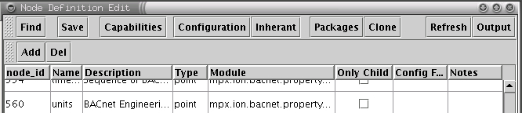
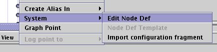

==================
NodeDef Guidelines
==================

:Author: Mark M. Evans
:Contact: mevans@envenergy.com
:Revision: $Revision: 20101 $
:Date: $Date: 2011-03-06 08:02:15 -0800 (Sun, 06 Mar 2011) $
:Copyright: 2003 Envenergy, Inc. Proprietary Information
:Abstract: This paper is intended to provide the guidelines for
	   creating new NodeDefs. 

.. contents::
   :depth: 1

-------
Purpose
-------

Since there is no published guidelines for creating 
NodeDefs, there are several shortcomings in the current
implementations of applications that rely on NodeDefs for
their user interface presentations.  The current applications
that use NodeDefs for user interface presentation are:

* The MPX Application
* The Evaluation Kit Application

Both of which rely on the Generic Mediator Configuration
Tool.  By documenting such guidelines, engineers will be
able to create NodeDefs in a manner that will provide a
consistent user experience, as well as provide the
information required to integrate new nodes into the
existing system.

------------
Introduction
------------

This is a living document that will be maintained as 
part of the source repository. As such, it will be 
frequently updated. During the transition period the 
paper in its current form may become a subsection of a 
future version.

While the current implementation of the NodeDef model 
has outlived its usefulness and must be refactored as 
part of the 1.4 MPX Application release cycle, we will 
need to support it as long as we release upgrades and 
one offs to the 1.2 and 1.3 releases. Furthermore, 
development of the 1.4 release can continue to use the 
current model until the refactored implementation is 
ready for use.

Document Style
--------------

Currently, this document lacks style.

----------
Disclaimer
----------

As mentioned in the Introduction_, these guidelines are for the 
current, soon to be refactored implementation.  Also, due to the general lack
of other documentation, this document currently contains a lot of ancillary
information.  Hopefully, both of these issues will be quickly resolved.

----------------------
Background Information
----------------------

The purpose of a NodeDef is provide "meta-data" about a 
node to client software. The "meta-data" 
includes: how to instantiate the node; the 
configuration attributes available for the node; a 
default description of the node; and other hints about 
field validation and reasonable assemblies of nodes.

The following points attempt explain the role that NodeDefs are meant play in
our software.  To do this, it is necessary to clarify the purpose of the Node
model itself, and a couple aspects of application design and GUI design.  These
points should exist is other documents and be covered in much greater detail,
but they don't yet.  The points are:

<content here>::

  1. The goal of the node model is ...
  2. The NodeDef ...
  3. Model-View-Controller / Model-View-Presenter
  4. ...

Node vs. NodeDef
----------------

A part of the confusion regarding the relationship 
between nodes and NodeDefs as well as the differences 
between a node and a NodeDef.

Collapsible ION Model
---------------------

The collapsible node model is the ability of one Node 
to provide the interfaces for what would classically be 
separate objects, leveraging Python's loose typing. A 
perfect example of why one would want such a thing is 
the overview section of virtually every network 
protocol every created. Open any specification on 
almost any networking protocol and it will say 
something like:

The foobar network protocol implements a collapsed "ISO/OSI Network
Model."

After such an opening statement, the specification will present all
sorts of valid reasons as to why the model was collapsed. With an ION
chain [#ION]_, the network is usually modeled with a collection of
collaborating nodes starting at a port, down to all the
devices. Already there are issues that different networks are
collapsed different ways. Then there are all the fun issues of "What
is a device?", "What is a point?" , "Are there groups of points that
can act like a single point?", ad infinitum.

.. [#ION] An ION chain is all the nodes from /interfaces through 
   any node modeling a physical point.

---------------
NodeDef Columns
---------------

In the future there will be better names for the different components of a Node
Definition.  For now, I use the term "NodeDef Column" to refer to the
NodeDef data presented in the "ION Definition Edit" window of the configuration
tool:

This window is opened via right clicking on a node and then selecting
the System->Edit NodeDef menu:

node_id Column
--------------

The node_id column contains the character string that uniquely identifies a
NodeDef. This string is automatically generated by the IONEdit tool and
should not be modified. An end user never sees the node_id.

Name Column
-----------

This is currently used as the default, or more accurately, the initial name
assigned to a Node Instance in a configuration.

Historically, a NodeDef's Name Column has been set according to one of the
following patterns:

1. A verbose, variable-like name (e.g. http_post_transporter,
   periodic_log, msglog_browser).
2. A name that matches the device's specification (e.g. 
   'CL1CKS', gen_volts_l) or physical label.

Regarding #1, the original intent of the verbose, variable-like names
was that the Node's URL would be largely a programmatic 
interface. While true to some degree, these names and 
the Node tree are regularly exposed to the end user. Hopefully in the
future, the GUI will collapse certain "implementation details"
together, depending on the perspective of the user.  Moving away from the
current "naming convention" toward the conventions detailed in the following
subsections should go a long way toward providing a better user experience.

As far as pattern #2, it is basically correct, as clarified below in the
`External Entities (aka Personalities)`_ subsection.

What's in a Name?
=================

A good name is one that concisely conveys the pertinent 
information to the user, is easy to read, and that does 
not contain redundant information that becomes noise 
from the user's perspective. Part of choosing a good 
name ultimately comes down to the context that a node 
is used. There are several aspects to the context:

1. How will the node be used?
2. What are its immediate relationships? (By immediate relationships, I
   mean parent, sibling and children nodes.)
3. Is it a inherent node?
4. Is it an only child?
5. What type of node is it?

Valid Characters
================

A name may contain any 8-bit characters, there are no restrictions. At
this time, the name is assumed to be comprised of characters from the
ASCII character set, but there are no limitations on what are valid
characters and the client can choose any character set when setting and
displaying names[#CS]_.

Many concerns have been raised about using URI "reserved" or "excluded"
characters in a name. The concerns stem from two major beliefs:

1. A user needs to be able to type the URL to a node.
2. Using such characters increases the risk of exposing 
   bugs related to URI escaping and unescaping of the 
   individual elements in a URI.

While I could rant about this, suffice to say that I believe that both concerns
are examples of artificial constraints.

In summary, all characters are valid, users should never have. It is very
powerful that a user can type a URI, but that is not the same as being
required to type a URI.  to type a URI and our software should be
solid enough to deal with it.

.. [#CS] Of course, the client should use the same character set when
         assigning a node and when displaying a name.  There is know formal
         mechanism to associated a character set with a name or URI.  At some
         point, character set information should be included in a formal way,
         but this should wait until "The Internet Engineering Task Force"
         specifies a standard solution [RFC2396:2.1].

Human Readability
=================

As mentioned earlier, names where originally intended 
to be programmatic in nature. This practice has 
continued long after the rational for it proved false. 
Names that are not tied to specific personalities 
should be easy for humans to read, which typically is 
mixed case words separated by spaces (" "). Examples:

  +-------------------+---------------------+--------------------+
  | Existing Name     | More Human Readable | Better Alternative |
  +===================+=====================+====================+
  | garbage_collector | Garbage Collector   |                    |
  +-------------------+---------------------+--------------------+
  | http_server       | HTTP Server         | Web Server         |
  +-------------------+---------------------+--------------------+
  | https_server      | HTTPS Server        | Secure Web Server  |
  +-------------------+---------------------+--------------------+
  | periodic_log_1    | Periodic Log 1      |                    |
  |                   | [#HR-N1]_           |                    |
  +-------------------+---------------------+--------------------+

.. [#HR-N1] The Configuration Tool appends the "_#" to the
	    name when creating a new, non-inherent node. Therefore,
	    the Configuration Tool would need to be modified to
	    support the " #" pattern.

Avoiding Redundancy
===================

There is no need to duplicate information that is obvious from the context in
which the node will be used.  Examples:

  +-------------------------+------------------+--------------------+
  | Existing Name           | Less Redundant   | Better Alternative |
  +=========================+==================+====================+
  | http_file_handler       | File Handler     | Default File       |
  | [#AR-N1]_               |                  | Handler [#AR-N2]_  |
  +-------------------------+------------------+--------------------+
  | modbus_holding_register | Holding Register |                    |
  | [#AR-N3]_               |                  |                    |
  +-------------------------+------------------+--------------------+
  | rna_xmlrpc              | RNA              |                    |
  +-------------------------+------------------+--------------------+

.. [#AR-N1] The "http\_" prefix is redundant. It is a file handler
	    "under" the HTTP Server.
.. [#AR-N2] There can be several file handlers, in this example node
	    is presumably configure as the handler for files under
	    "/".
.. [#AR-N3] The context of this is always used as part of a user
	    definable Modbus device.

<content here>::

  More meaningful examples:

    'BACnet Present Value Property' -> 'Present Value' ?
    ?

External Entities (aka Personalities)
=====================================

An external entity is any real world system that the mediator represents as a
collection of nodes.  An external entity is comprised of one or more of the
following 'types' of nodes:

* A node that represents the physical device, in total.

  This is the node that is the 'anchor' for the entire device. The
  pattern "Vendor-Name Model Device-Type" when providing the default
  name of a device. Frequently, the vendor will have their own term or
  acronym for the Device-Type. In these cases, I believe we should use
  the vendor's term for the Device-Type, rather than our standard
  term. Example names (Unfortunately, we don't support many of these
  devices. All these names were created by surfing the companies
  web-sites and following the above guideline.):

  * "Trane Tracer Summit BCU"
  * "Trane Tracker WSHP BAS"
  * "Trane Tracker Stat 16 BAS"
  * "Veris H8306 Power Meter"
  * "Generac DG50 Generator"
  * "Generac MD1800 MPS"
  * "Advantech ADAM-4011 Remote I/O"

* Organizational nodes that represent logical functional collections.

* Organizational nodes that represent physical collections.

* Nodes representing physical points.

  This is a node that represents the physical 
  measurement by the device. If the connection point on 
  the device is labeled, then the node should be named 
  exactly as labeled. If the device is interpreting the 
  value into a unitary measure, then the name should 
  append " (Unit-Name)" to the point. Otherwise, 
  according to the design of the Mediator Framework, 
  the value returned should be uninterpreted. In other 
  words, if the point is an Analog In and the device 
  returns an integer in the 0-1023 range for 
  measurements on the Analog In, then the point should 
  be named exactly as the physically labeled point and 
  return the value 0-1023.

  Since URIs do not currently support specifying character sets, the list of
  Unit-Names should conform to `ANSI/IEEE Std 260.1-1993`_, applying clauses
  6.1 6.2, 6.3, 6.4.  Do not apply clause 6.5 since we are not limited to a
  single case.

  <add reference to table of likely units that does not exist yet>

* Nodes representing logical (aka virtual) points.

* Nodes representing logical conversions.

  Frequently, the value returned by a point will 
  require some sort of conversion to be useful. In 
  these cases, there should be an inherent child (or 
  children) that convert the value. If the translated 
  value is unitary, than the name of the point should 
  be the abbreviation of the unit. An example of this 
  is the Dallas 18B20 temperature sensor which returns 
  the temperature as 1/12ths of a degree Celsius. In 
  these case, the point itself should not preform the 
  conversion, a child of the point should. This is a 
  fundamental tenant of the Mediator Framework design 
  that at the core, no information is hidden.

Examples:

  +---------------+-----------------------------------+
  | Existing Name | More Human Readable Alternative   |
  +===============+===================================+
  | veris8036     | Veris H8036 Power Meter [#P-N1]_  |
  +---------------+-----------------------------------+
  | kWh           | Energy Consumption (kWh) [#P-N2]_ |
  +---------------+-----------------------------------+
  | C.A           | Current, phase C (A)              |
  +---------------+-----------------------------------+

.. [#P-N1] This is an example of the "Vendor-Name Model Device-Type"
	   pattern.
.. [#P-N2] From the Veris 8036 documentation.

User Definable Nodes
====================

Instead of the terms "Generic" or "Custom", the convention for devices that the
end user assembles from components is:

  For **actual** devices
    User Definable *Protocol* Device

    Examples::

      User Definable BACnet Device
      User Definable Modbus Device
      User Definable DNP Device

  For **proxy** Virtual *Protocol* Device
    Virtual *Protocol* Device

      Virtual BACnet Device
      Virtual Modbus/TCP Device
      Virtual DNP Device

Protocol Naming Conventions
===========================

For protocols that are master/slave, or client/server, the convention is to
name the protocol with the pattern 'Protocol-Name Protocol-Perspective' where
the Protocol-Perspective uses the terminology of the protocol. Examples::

  com1
    Modbus Master
      User Definable Modbus Device
        ...
      Veris H8036 Power Meter
        Energy Consumption (kWh)
        Current, phase C (A)

  com2
    Modbus Slave
      Virtual Modbus Device
        ...
      Virtual Modbus Device 2

  eth0
    Modbus Client
      Generac DG50 Generator
        ...
      Some SCADA Device
        ...
    Modbus Server
      Virtual Modbus Device
        ...
    IP Alias
       Modbus Server
         Virtual Modbus Device
           ...

Interestingly, the above convention creates a clear separation for actual and
virtual devices.  For BACnet, which provides peer-to-peer intercommunication,
the separation of actual devices and virtual devices is in its network
layer. Examples::

  eth0/
    BACnet/Ethernet
      Mediator Device
      Network 1
        Tracer Summit BCU
          ...
        Field Server Beasty
          ...
      Virtual Network 2
        Virtual BACnet Device 1
          ...
  com3
    BACnet MS/TP
      Mediator Device
      Network 3
        Alerton Doohickey
          ...
      Virtual Network 4
        ...

.. note:: Review with Fred.

Services
========

Services should follow the basic mixed case, space separated model.

User Name Modification
======================

At this time, a user can only rename non-inherent nodes.  This is too limiting,
but to support renaming inherent children will require extra work.

Renaming Existing NodeDefs
==========================

<content here>::

  Reverse compatibility issues:
    Well known services:
      Code issues ...
      Existing configuration issues ... 
    Existing configurations in general:
    ?

Description Column
------------------

The description column has three uses:

1. The text displayed when constructing the list of possible nodes in
   the "Add" dialog.
2. The tool-tip displayed for the node instance in the node tree.
3. The user definable "notes" about a node.

The description should be created using the conventions as the name column,
as defined above.  In other words, the initial naming conventions should be
sufficient in uniquely identifying the Node in the "Add" dialog and is a
reasonable description of the node if the user renames the node.

The user is still free to change the description, on an instance, to provide
installation specific information.

.. note:: The current *Add* dialog displays 'Description-Column
          (Name-Column)'. This currently is confusing, e.g.:

            User Defined Web Server (http_server)

          Given the new naming conventions, it would be outright redundant:

            User Definable Web Server (User Definable Web Server)

.. note:: We could use the description to (optionally) contain additional
          'help like' information.  If we do this the *Add* dialog would need
          to be modified to display 'Name-Column', instead of
          'Description-Column'.  This was actually what was originally
          displayed, but because of our variable-style naming conventions it
          did not make much sense.  The change at this time does not seem vital
          since we could always put the additional 'help' information in the
          Notes Column.

          **One advantage of displaying the 'Name-Column' in the Add dialog is
          that we would not need to have duplicate the 'Name-Column' content in
          the 'Description-Column' and we could leave the 'Description-Column'
          blank.**

Type Column
-----------

This column supports defining a node as being a single type: point, service,
device or protocol.  This column currently imposes an over simplified model on
our node model and ultimately will be replaced by supporting the concept of
'interface' capabilities.

For now, please select the type that the node most closely resembles.  If it is
none of the above, select service.

Only Child Column
-----------------

Check this if this node should *never* have siblings.

.. note:: This is overly restrictive and will have to be replaced with some
          sort of rule set in the future.

Config Form Column
------------------

The Config Form column is used as a factory to load a *plug-in* in the user
interface.  The purpose behind a plug-in is to provide a mechanism to provide
a more user friendly interface to a complex object.

.. note:: This ability to add plug-ins is an excellent start to be able to
          provide a more intuitive, usable, interface to the user.
          Unfortunately, the current implementation has two major short
          comings:

          1.  Ultimately, the plug-in is abstracting too little of the
              implementation too be of great value.  In other words, the
              plug-in
              does not change the structural presentation of implementation
              node tree, it just allows a single node the provide a different
              face.

              While some NodeDefs have assigned the same wizard to
              multiple levels of the implementation tree, this does nothing to
              change the end users overall view of the system.

          2.  The limitation of having, at most, one plug-in for a node makes
              it difficult to provide multiple views of the same node or
              collection of nodes.  For example, we should be able to present a
              nice, single window configuration overview for a *UserLog*
              [#UL-1]_.
              We should be able to provide a view of the data in a
              *UserLog*.  And we should be able to have a view of the
              state of a *UserLog*.  The list of the number of views on a
              *UserLog* should be constrained be the **user**'s
              requirements, not by a single column in an arbitrary database.

              .. [#UL-1] A *UserLog* is the abstract concept of a log,
                         from the perspective of the end user.  This is an
                         example of a "Domain Object". The fundamental Node
                         architecture **intentionally** does not model domain
                         objects, it models implementation objects.  The reason
                         for this is that the The Mediator Framework is not
                         tied to a specific business domain.  OK, technically,
                         the node model is meant to provide the "lower layers"
                         of the *implementation* of the many business
                         domains.

                         The Mediator
                         Framework is an architecture to be able to quickly
                         assemble collection of collaborating implementation
                         objects the satisfy the functionality of a domain
                         object.  It is also designed to facilitate quickly
                         developing and integrating new nodes to satisfy new
                         functionality in a manner that is not tightly coupled
                         to existing software components.  Finally, it is
                         designed to support doing all of this in a dynamic,
                         introspective manner.

                         The NodeDefs are meant to provide the meta-data
                         required to allow for implementation level
                         configuration and to assist domain objects assemble
                         correct collaborations of nodes. It is possible, and
                         reasonable, for a specific 
                         application package to implement a node, or collection
                         of node's that are domain objects and provide an API
                         to those objects.  It is also
                         possible, and reasonable, for the client application
                         (e.g. MPX Application GUI, MMS, etc...) to implement a
                         domain model that interacts with the underlying node
                         model.

Notes Column
------------

Currently, the Notes column of a NodeDef is unused.  The original intent was
for helpful textual information about using the Node.  The idea was that the
information would be in a scrollable text area on the configuration page.

-----------------------------
Capabilities and Requirements
-----------------------------

<content here>::

  overview would be helpful

Capabilities
------------

<content here>::

  list of capabilities and when to use them:
  - Interfaces ...
  - Parent is lazy ...

Some capabilities should only be used in requirements lists and **never** be
satisfied by being in any Node's capabilities list.  The current set of these
capabilities are:

``inherent``
        A NodeDef that should only be used in conjunction with it's inherent
        parent's and should not ever be presented in an Add list to an end
        user [#add-in]_ .

``deprecated``
        A NodeDef that, for whatever reason, should no longer be generally
        available.

.. [#add-in] Actually, since a user can delete an explicit inherent node, it
             would be nice if there were a way to add back, missing, inherent
             nodes.

Requirements
------------

The requirements list of a NodeDef should accurately reflect a node's
expectations from it's parent.

For a Node that is only used as an inherent child, the requirements
should include ``inherent``.  When deprecating a NodeDef, Add the
``deprecated`` requirement. This will prevent the Node from appearing in the
Add list for any other node.

<content here>::

  - future: adding requirements to Node's attributes

-----------------------------
NodeDef Configuration Columns
-----------------------------

Again, the terminology will change.  For now, I use the term "NodeDef
Configuration Column" to refer to the NodeDef data presented in the "ION
Configuration Editor" window of the configuration tool:

  <image here>

which is opened via the "Configuration" button on the "Node Definition Edit"
window:

  <image here>

Attribute NodeDef Configuration Column
--------------------------------------

The Attribute NodeDef Configuration Column
defines the name of the actual Python attribute to set on the
implementation of the node.  This value must be identical to the attribute as
it is defined in the implementation and is not visible to the end user.
However, I would like to suggest that we start migrating to semi-private names
for these attributes for new Node implementations.  Specifically, I would like to
start prefixing configuration attributes with a known prefix like '_c_' for
several reasons.

Label NodeDef Configuration Column
----------------------------------

This is the text presented to the end user to uniquely identify each widget on
the configuration form.  This should convey enough information so the user can
guess it's function, without being overly long.

Description NodeDef Configuration Column
----------------------------------------

This contains the help information that is displayed as a tool-tip
when the mouse hovers over the attribute's widget in the GUI.

The description
is used to display end-user help information about the attribute.  But since
this is displayed as a tool-tip, it does not scale well.  Furthermore, since
the text is in the NodeDef itself, nationalization is not possible [#NAT]_.

.. note:: After the refactor, this field will be split in two fields of the
          attribute: help_text and tool_tip.
          Ultimately, these fields will be references to a
          resource that contains the string.

We should use the Description NodeDef Configuration Column specifically as a
tool-tip and not 'pollute' it with additional information.

.. note:: To capture additional help information we should look into the help
          infrastructure that Casey was putting in place using text files.

The description should always contain a single sentence.
This sentence is intended as the tool-tip and it should be in the
command form [#CMDQ]_, conveying what the end user should do.  Examples

   TextFields:

     For an SMTP exporter:
         Enter the host name or IP address of the SMTP mail server.

     For a modbus address:
         Enter the device's address.

   For ComboBoxes, the tool_tip sentence should start with the phrase "Select":

     Select odd, even or no parity.

     Select the data rate in bits/second.

   For CheckBox's, the sentence should start with the phrase "Check to " or
   "Uncheck to " which ever is opposite the default [#CT]_ :

     For the Enabled [#EL]_ label on most nodes:
         Uncheck to disable this Web-server.

         Uncheck to disable this comm port.

     For the Debug [#DL]_ label on most nodes:
         Check to generate internal diagnostic information.

  For Tables:

    The tool_tip for a table is almost useless at this time since what is
    really needed is a tool_tip per column.  For now I suggest the following:

    i. Describe the table in a simple statement like:

       Table of user defined attributes and values.

    ii. Extend the use of the attribute's Init to include a 'Tip' definition.
        For example, in the Init field of *some* Table attribute::

            <Name=Attribute Name|bindname=name|Type=TextField>
            <Name=Attribute Value|BindName=definition|Type=TextField>

        becomes::

            <Name=Attribute Name|bindname=name|Type=TextField|Tip=Enter...>
            <Name=Attribute Value|BindName=definition|Type=TextField|Tip=...>

.. [#CT] This is a bit ugly, but this document is suppose to be relevant to our
         current NodeDef implementation which is extremely limiting.

         Personally, I'd like us to have "active labels" for check boxes.
         Something like::

            [ ] Service disabled, click to enable.

         and::

            [x] Service enabled, click to disable.

.. [#CMDQ] Perhaps someone how knows the details of the English language
           specification could describe this more clearly.

.. [#NAT] While not a major issue now, it should be considered during the
          refactor.

.. [#EL] The purpose behind the 'Enabled' label is basically that there are
         times for a multitude of reasons that one may want to take a device or
         service 'out of service.'  At the lowest layers, this is setting the
         node's 'enabled' attribute to false.  Any ideas on present this to an
         end user would be helpful.

.. [#DL] This is a perfect example of an attribute that we really don't want
         visible to end users unless they specifically ask for it.  Ideally, we
         could mark attributes as 'advanced' and/or 'diagnostic' and then hide
         them from the typical end user, but still have access to them for
         support.  This same comment applies to many read-only attributes.

Field Type NodeDef Configuration Column
---------------------------------------

The Field Type provides a list of available widgets to the end user for editing
the configuration attributes of a node.  The available widgets are:

  TextField
        This is the most flexible, and therefore most dangerous, configuration
        attribute type because it allows the user to enter 'anything'.  This
        field should only be used when:

        1. It is appropriate that the end user should be able to type in a
           single line of 'anything'.
        2. There is no, correct, widget.

        .. note:: By design, a node *must* be able to accept a text
                  representation of every configuration attribute.
                  Ultimately, all widgets input and output simple text to
                  describe the assigned value.

                  For engineering, QA, support and super educated customers,
                  it would be extremely valuable if the "Implementation View"
                  of a node, allowed the super smart person to request using a
                  text widget instead of the assigned widget.  This is to work
                  around bugs, false constraints, missing or incorrect
                  NodeDefs, etc., without having to hack the broadway.xml
                  file.

        .. note:: On the other hand, it is a **major hack** that many of our
                  node's can parse *overly* human readable text.  There are
                  many places were we have added all sorts of parsing magic to
                  so an end user can type a *hopefully* more intuitive
                  string into a general purpose text field.
                  Unfortunately, having to correctly type
                  ``Jan 03, 03 10:00`` and a few variants is not user
                  friendly.  Period.  Furthermore, this practice
                  is dangerous in that it introduces unnecessary code and
                  establishes a vague 'text API' at the wrong level.  *I am not
                  blaming anyone, it is a practice we
                  adopted because it was perceived
                  as 'too hard' or 'too much work' to
                  add the widget to the
                  configuration tool.  So, we did what we
                  thought we 'had time for'.*

                  There should be a nice Date
                  widget, DateTime widget and TimeSpan widget.  These widgets
                  should know how to convert between a well defined string
                  representation (seconds since 1970, UTC) and a nice human
                  representation.  It is acceptable to support a more human
                  readable format (derived from RFC #2822 or RFC #3339)
                  that is well defined.

                  There should be widgets for entering all sorts of values:
                  IP addresses, MAC addresses, Modbus addresses, BACnet device
                  numbers, etc...  These widgets are the *view* on the
                  domain object that is an XXX attribute.  The configuration
                  attribute *view* widgets/objects [#DO-1]_ should be able
                  to implement solid
                  validation rules (like that no two modbus devices on the same
                  bus should have the same address).

                  **I firmly believe we should be able to evolve these
                  capabilities.  After all, the basic hook is already in
                  place. I also believe that our unwillingness to create a
                  powerful set of widgets (that can be extended via both code
                  and configuration), is a major reason that the implementation
                  level configuration is not much more user-friendly, and
                  safe.)**

                  .. [#DO-1] and/or the configuration attribute domain
                             objects...

  TextArea
        *not implemented, do not use*

  Password
        This widget should be used for 'secrets' that should not be visible on
        the user interface, but require end user 

  ComboBox
        Use the widget when the user is constrained to select one item out of a
        list of possibilities.

        .. note:: It is a major limitation that this widget does not allow the
                  user to enter a custom value (checked against the validator),
                  as well as select a value from the list.  It is ugly that the
                  first value is the default.

  Spinner
        *not implemented, do not use*

  SpinnerDate
        *not implemented, ugly, do not implement,
        do not use* ``:-p``

  CheckBox
        Select the CheckBox configuration attribute Field Type for truly boolean
        options.  Do not use the CheckBox because there are currently only two
        options (e.g. bind to all IP interfaces, or eth0).

        A list can grow in the future, a boolean should not.

  Node
        Select the ``Node`` configuration attribute when the user is expected
        to refer to another node.

  Table
        <add use guidelines.>

  Readonly
     This field allows for the creation of NodeDefs that have some or all of
     there configurable attributes pre-configured.

     .. note:: It would be nice if the configuration tool did not display
               read-only fields by default.  It would also be nice if there
               were still an option to see them.

               It would be *nicer* if this were a property of the
               configuration attribute, along with another 'visibility'
               property that provided a hint that an interface could use to
               determine whether the field should be displayed to the end
               user or not.

  Action
    The Action field type allows connecting a button press to invoking a
    configurable object in the Configuration Tool. *Only the
    RZ package implements this now, unless there is a
    specific Java implementation to suite
    your need, do not use.*

.. note:: It is a major limitation that we do not have a widget that allows
          you to select multiple items from a list (aka a ListBox).

Init NodeDef Configuration Column
---------------------------------

This field serves three [#I1]_ purposes:

1. To provide the initial, aka default, value.
2. To describe the valid entries for selection for ComboBox widgets.
3. To provide the 'layout' of a table widget.

.. [#I1] This is an evolved overuse of the Init field and will be refactored
         in the next NodeDef implementation to separate the initial value from
         additional data requirements for some widgets.

Sequence NodeDef Configuration Column
-------------------------------------

This field controls the order that each field is displayed in a configuration
page.  The numbers do not need to be sequential, but the same number should not
be used twice for the same NodeDef.

Furthermore, the sequence should enforce the following rules:

* The enable (if listed) attribute should be first.  This is so it is obvious
  if the node is enabled or disabled.
* Immediately following the enable attribute should be the user modifiable
  attributes (except for debug).  These attributes should flow in as logical of
  an order as possible:

    - Related items should be listed together (e.g. host name and port).
    - If there is a natural flow to the information, like a mailing address, the
      Configuration Attribute Rows should follow that sequence.
    - If there are Configuration Attribute Rows that have default values, are
      rarely used, and it does not break the above suggestions, they should be
      at the end of the user modified list.
* The debug attribute should be after all other attributes, **except** the
  read-only attributes.
* Read-only fields should be last.

Validator NodeDef Configuration Column
--------------------------------------

This combobox is used to select a field validator. Any field that
allows textual input by an **end user** the end user should have a
validator.

Validator Config NodeDef Configuration Column
---------------------------------------------

This text widget allows for the entry of validator specific
parameters.  See Chet for details of the syntax and uses.

.. note:: It would be extremely valuable if we could template Validator
          Configurations.  It would be a lot less work, and more supportable if
          there here a single, generic 'host name or IP address'
          StringValidator configuration (regular expression).

--------
Inherent
--------

There are two types of inherent children:

  explicit
    These are the inherent children that are defined solely by NodeDefs.

  implicit
    These are the inherent children that are 'guaranteed' by the parent Node's
    implementation.  Typically implicit children model something physical (like
    the 1200 or Veris Meter), or the are fundamental services/interfaces to the
    system ('/services/garbage_collector').

Changing the name of an explicit, inherent child would cause confusing things
to happen. Currently, the user can change the name of any node for which there
is a NodeDef, and that NodeDef is not the inherent child of it's parent.
Therefore, for any implicit, inherent, Node please do one of the following:

1. Define the inherent relationship explicitly in the NodeDef.
2. Do not define a NodeDef for the child.  There is no need define a NodeDef
   for a node which the user does not interact with.

.. note::  Ideally, the configuration tool would not display nodes without
           NodeDefs in the tree unless the user specifically asked to see
           them (/services/garbage_collector, /services/session,
           /services/network/configuration_service, ... are all examples of
           implementation details that the user normally does not care about).

--------
Packages
--------

A NodeDef should belong **one** of the following:

  envenergy.nodedefs.all:

    Use this package if the node is only intended for the internal
    use of engineering.

  The package in which implements it's factory:

      Use these packages whenever all users of the package should be able to
      access the NodeDef::

        broadway
        broadway.core
        broadway.dnp
        broadway.ion
        broadway.rz
        broadway.sdk.client
        cinemark.pilot
        enerwise.dis
        envenergy.bacnet_connect
        envenergy.eval_system
        envenergy.mpx
        envenergy.mpx+dnp
        envenergy.nodedefs.all
        envenergy.tsd1
        kmc.demo1
        protocols.mehtatech
        trane.tracer100.demo
        trane.tsws
        walmart.demo1.mediator
        walmart.demo1.server
        walmart.pilot.mediator

As well as one of the above entries, a NodeDef can be associated with
additional 'applications.'  This allows applications to present specific
'pre-configured' Node Definitions.

Please note that envenergy.ema is no longer a valid application.

.. note:: I think we can nuke envenergy.mpx+dnp, since that should be
          integrated into envenergy.mpx.

----------
References
----------

`Uniform Resource Identifiers (URI): Generic Syntax`_

.. _`Uniform Resource Identifiers (URI): Generic Syntax`:
   http://www.ietf.org/rfc/rfc2396.txt

`Centre for Innovation in Mathematics Teaching: A Dictionary of Units`_

.. _`Centre for Innovation in Mathematics Teaching: A Dictionary of Units`:
   http://www.ex.ac.uk/cimt/dictunit/dictunit.htm

`ANSI/IEEE Std 260.1-1993`_

.. _`ANSI/IEEE Std 260.1-1993`: IEEE_Std_260.1-1993.pdf

<content here>::

  Add RFCs with links...

-------------------
About this Document
-------------------

This source for this document, `NodeDefGuidelines.rst`_ is
written using the ReStructuredText markup language which is
part of Python's docutils package.  Modifications to this
document must conform to the
`reStructuredText Markup Specification`_.
If this is your first exposure to reStructuredText, please
read `A ReStructuredText Primer`_ and the `Quick
reStructuredText`_ user reference first.

.. _`NodeDefGuidelines.rst`: NodeDefGuidelines.rst
.. _`reStructuredText Markup Specification`:
   http://docutils.sourceforge.net/spec/rst/reStructuredText.txt
.. _`A ReStructuredText Primer`:
   http://docutils.sourceforge.net/docs/rst/quickstart.html
.. _`Quick reStructuredText`:
   http://docutils.sourceforge.net/docs/rst/quickref.html

-----------
CVS History
-----------

The CVS log of changes to this file.

$Log: NodeDefGuidelines.rst,v $
Revision 1.3  2003/07/24 04:54:13  mevans
First Draft of NodeDefGuidelines.

Revision 1.2  2003/07/15 04:03:15  mevans
Interim checkup of functional system to avoid future conflicts and to backup this source base.

Revision 1.1  2003/07/11 01:21:28  mevans
Paranoia update of the NodeDef Guidelines.

